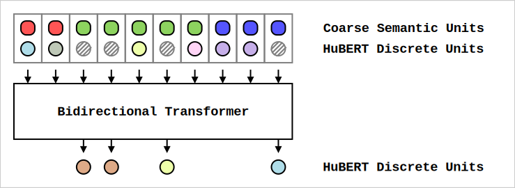
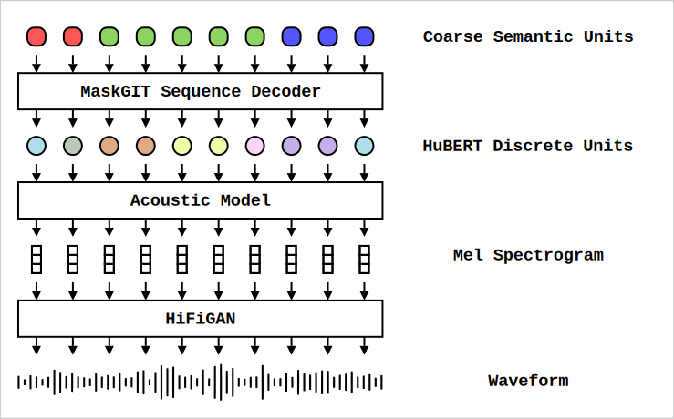

# Sequence-to-sequence MaskGIT Decoder

A simple model to generate [HuBERT discrete](https://github.com/bshall/hubert) units from coarse semantic tokens (e.g. [ZeroSyl](https://github.com/nicolvisser/ZeroSyl), [SyllableLM](https://github.com/AlanBaade/SyllableLM) or [Sylber](https://github.com/Berkeley-Speech-Group/sylber)) and then vocode to the LJ Speech voice using the decoder from from [Soft-VC](https://github.com/bshall/soft-vc). 

## Model

Under the hood the model is a transformer with bidirectional attention.
Tokens are masked following a [MaskGIT](https://arxiv.org/pdf/2202.04200) schedule.
Both the coarse semantic units and [HuBERT discrete](https://github.com/bshall/hubert) units are embedded.
The embeddings are combined and positional encoding is added both for global positions (sinusoidal positional embeddings) and within-segment positions (learned positional embeddings).
The model predicts a distribution over the masked HuBERT discrete units.

## Pipeline

We use the semantic units from [ZeroSyl](https://github.com/nicolvisser/ZeroSyl) as input.
To synthesize audio from these units, we run the sequence-to-sequence [MaskGit](https://arxiv.org/pdf/2202.04200) decoder to generate [HuBERT discrete](https://github.com/bshall/hubert) units. Then we use the acoustic model (discrete version) from [Soft-VC](https://github.com/bshall/soft-vc) to generate a mel spectrogram in the voice of LJ Speech. Finally we vocode to a waveform using a [16 kHz HiFiGAN](https://github.com/bshall/hifigan) model.

## Repo structure

- [model.py](./model.py) - houses the model
- [train.py](./train.py) - train a new model
- [infer.py](./infer.py) - synthesize and save waveforms from precomputed segments

## Checkpoints

- [S2SMaskGit-ZeroSylCollapsed-hubert-discrete-train-clean-100-10k-steps.pt](https://storage.googleapis.com/zerospeech-checkpoints/S2SMaskGIT/S2SMaskGit-ZeroSylCollapsed-hubert-discrete-train-clean-100-10k-steps.pt)
  - Trained using [ZeroSylCollapsed](https://github.com/nicolvisser/ZeroSyl) semantic units
  - to predict [HuBERT discrete](https://github.com/bshall/hubert) units
  - on LibriSpeech train-clean-100
  - for 10k steps